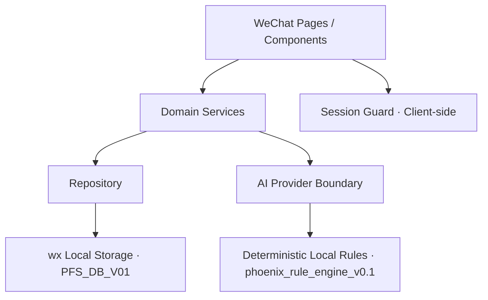

# Phoenix Family OS™ Architecture Memory

- Memory type: Current architecture and bounded extension memory
- Current version: MVP V0.1
- Status: As implemented at commit `bb972f030994a35a1e81bd0d38ff502410127b84`
- Last reviewed: 2026-08-15（Asia/Shanghai）

## 1. 当前技术架构

Phoenix Family OS™ V0.1 是原生微信小程序，本地可运行，无远程业务 API。



### 1.1 分层职责

| 层 | 目录/文件 | 职责 |
| --- | --- | --- |
| App shell | `app.js`, `app.json`, `app.wxss` | 启动、路由、tabBar、全局样式和当前用户 ID |
| Pages | `pages/` | 页面状态、交互、表单绑定和导航 |
| Component | `components/brand-mark/` | Phoenix Nova 深浅/紧凑品牌展示 |
| Domain services | `services/` | Auth、Session、Repository、Store、AI、Analytics、Partner preview |
| Models | `models/schema.js` | 本地逻辑表和枚举声明 |
| Data config | `data/partner-experiences.js` | Partner Experience preview 内容配置 |
| Utilities | `utils/` | 日期、ID、导航栏/胶囊安全区 |
| Tests | `tests/` | Node assertions 和静态项目验证 |
| Documentation | `docs/` | 架构、schema、验收、审计、交接和工程记忆 |

### 1.2 运行边界

- `services/store.js` 通过 `wx.getStorageSync/setStorageSync` 持久化完整对象。
- `services/repository.js` 提供通用 CRUD 和家庭关系查询。
- Page 层调用 Repository；Repository 本身没有 actor/permission context。
- `services/session.js` 的 guard 是客户端页面保护，不是生产安全边界。
- `services/auth.js` 调用 `wx.login`，但最终使用共享本地 demo identity。
- `services/ai-provider.js` 是未来可信云函数的替换边界；当前不联网。

## 2. 页面结构

### 2.1 Family-facing pages

| Route | 作用 | 主要数据 |
| --- | --- | --- |
| `pages/welcome/index` | 家庭登录与内部 Advisor demo 入口 | User/session |
| `pages/home/index` | 家庭首页、进度和下一步 | Family、Student、Report |
| `pages/family-edit/index` | Family Profile 表单 | Family |
| `pages/student-edit/index` | Child Profile 表单 | Student |
| `pages/compass/index` | Education Compass 入口和历史报告 | Student、Report |
| `pages/compass-questionnaire/index` | 5 步 10 题问卷和报告生成 | Assessment、Report、Timeline |
| `pages/report/index` | AI Growth Insight 展示 | Report → Assessment → Student → Family |
| `pages/timeline/index` | Family Timeline 活动流 | Timeline Event |
| `pages/advisor-request/index` | 家庭申请顾问联系 | Advisor Request、Timeline |
| `pages/mine/index` | 家庭资料、统计和退出 | User、Family、Student、Report |

### 2.2 Advisor demo pages

| Route | 作用 | 权限现状 |
| --- | --- | --- |
| `pages/admin-families/index` | 查看和搜索全部家庭 | local `admin` guard；无 assignment/consent |
| `pages/admin-family/index` | 家庭概览、报告、请求、备注 | local `admin` guard |

### 2.3 Partner Experience preview pages

- `pages/partner/yuanchao/index`
- `pages/partner/music-exploration/index`
- `pages/partner/apply/index`

这些页面是已有 preview，不属于 Family Growth Core 的实现证据，不扩展为 Partner Portal、后台或 marketplace。

### 2.4 Navigation

- tabBar：Home、Family Timeline、Mine。
- Welcome 与部分 Partner 页面使用动态状态栏/微信胶囊安全区。
- 页面底部使用 safe-area fallback，避免 Home Indicator/Android 导航栏遮挡。

## 3. 数据模型

### 3.1 当前本地逻辑表

| 表 | 字段摘要 | 关系 |
| --- | --- | --- |
| `users` | identity、profile、role、created_at | User → Family |
| `families` | user_id、name、parent、phone、location、goal | Family → Students/Timeline/Advisor |
| `students` | family_id、child profile、education context | Student → Assessment |
| `assessments` | student_id、type、answers、status、created_at | Assessment → Report |
| `reports` | assessment_id、summary、recommendation、created_at | indirect Family ownership |
| `timelineEvents` | family_id、event_type、description、date | Family activity feed |
| `advisorNotes` | family_id、advisor_id、note、follow-up | Advisor demo history |
| `advisorRequests` | family_id、user_id、topic、time、status | Family handoff request |
| `analyticsEvents` | user/family/event/properties/time | Product analytics only |
| `partnerExplorations` | family/student/preview/answers/result | preview data |
| `partnerApplications` | family/user/preview/application/consent boolean | preview request |
| `partners` | partner identity placeholder | empty placeholder |
| `permissions` | family/partner/scope placeholder | empty and unenforced |

### 3.2 核心关系

```text
User
└─ Family
   ├─ Student
   │  └─ Assessment
   │     └─ Report
   ├─ Timeline Event
   ├─ Advisor Request
   └─ Advisor Note
```

Report ownership is resolved in code through:

```text
Report → Assessment → Student → Family → User
```

### 3.3 数据模型限制

- `models/schema.js` 是字段清单，不提供类型、required、FK、unique 或 index 约束。
- 没有 migration ledger；Store 只做非破坏性表数组 normalization。
- Family/Student 更新会覆盖当前值，没有 relationship/fact history。
- `timelineEvents` 是活动历史，不是完整 Timeline Item。
- `analyticsEvents` 不是 AuditLog。
- `privacy_consent` 只存在于 Partner Application boolean，不是 Family Consent。
- 多次本地写入没有事务或幂等保障。

## 4. 当前数据流

### 4.1 Family onboarding

```text
Welcome
→ auth.loginFamilyUser
→ local User/session
→ Family form
→ repository.upsertFamily
→ Student form
→ repository.upsertStudent
```

### 4.2 Compass and Insight

```text
Student
→ Compass Questionnaire answers
→ Assessment insert
→ aiProvider.generateGrowthInsight
→ Report insert
→ Timeline events insert
→ Report page
```

### 4.3 Advisor handoff

```text
Family User
→ Advisor Request
→ Advisor Request record + Timeline Event
→ local Admin family overview
→ Advisor Note + Timeline Event
```

## 5. 当前权限架构

### Positive controls

- Family/Student/Compass 提交前重新检查 `family_user` session。
- Student/Compass/Report 有部分 family ownership 比对。
- Timeline 从当前用户反查 Family，不接受外部 family ID。

### Critical limitations

- Family identity 固定为共享 `local_family_user`。
- Advisor demo 直接切换到本地 seeded `admin`。
- Admin 可以读取全部 Family，无 assignment、consent 或 audit。
- `permissions` 表未被任何 guard 使用。
- 客户端 guard 不能作为生产 RBAC。

## 6. 扩展方向

扩展方向只记录已确认的工程边界，不代表自动授权实施。

### 6.1 生产化替换边界

- 保留 Page → Service → Repository 分层。
- 用受信任 Repository adapter 替换本地 Store。
- 在服务端完成 WeChat code/openid/session 交换。
- 在服务端执行 family ownership、advisor assignment、consent scope 和 audit。
- 通过受保护 AI provider/云函数替换本地规则 provider 时保持调用边界。

### 6.2 Family Growth Core 方向

如获得正式 Sprint 批准，必须基于 `Family Growth Core Freeze V1.0`：

- Family Member 和 relationship history；
- fact source、confirmation、updated_at；
- Growth Blueprint 五段结构和版本链；
- Timeline Item、状态、owner、source、change history 和 reminder；
- Consent、Advisor Relationship、Audit；
- API/server-side RBAC 和负向测试。

当前决策仍为 Family Growth Agent™ NO-GO / HOLD。

### 6.3 角色扩展

- Advisor/Admin 可在未来使用相同核心数据层，但必须先有可信身份和权限模型。
- Partner 只能通过家庭授权访问最小范围，不自动获得 Portal 或后台。
- 不新增 Wealth、Health、CRM、商城、支付或 autonomous multi-agent modules。

## 7. 架构不变量

- 当前产品闭环不能被新的二级功能替代。
- 所有家庭业务数据必须可追溯到 Family。
- AI 推断不能覆盖已确认事实。
- 缺数据应显式 pending/unknown，不编造。
- 页面不直接绕过 Repository 写 Storage。
- 生产权限必须在可信服务端执行。
- Schema 变化必须通过可回退 migration，不静默覆盖。
- 品牌图通过 Brand Mark 和批准资产清单管理。

## 8. 记忆维护规则

- 真实架构改变后立即更新本文件及 Decision Log。
- 目标架构不能写成当前已实现架构。
- 每项架构描述应能追踪到文件、commit 或 inspection。
- 已废弃设计保留在 Decision Log 的 superseded 记录中，不删除历史原因。
