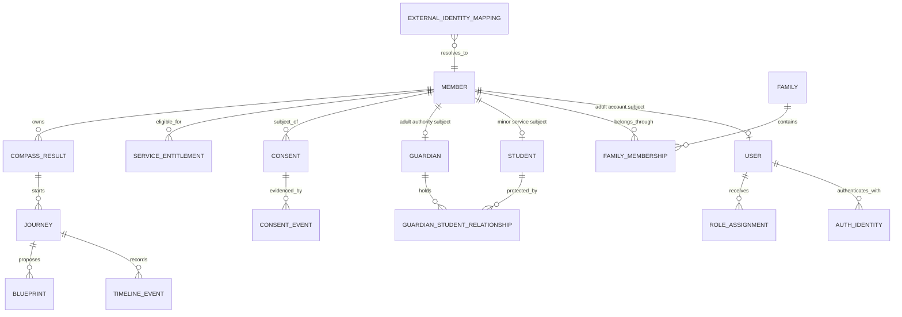

# Family Core Mapping

Status: `EXECUTABLE SYNTHETIC MAPPING / NO REAL DATA`

## Core identity spine



`member_pk` is an internal relational spine. Public Phoenix identities remain `user_id`, `family_id`, `student_id`, and `guardian_id`; the sandbox does not mint a fifth public identity contract.

## Current source to Core mapping

| Current source | Current field/store | Core destination | Rule | Blocker / evidence |
| --- | --- | --- | --- | --- |
| Family OS browser/WeChat local user | `users.id`, `wechat_id`, mutable contact fields | `core.users` + `core.auth_identities` + adult `core.members` | Preserve verified provider/Auth UUID; create mapping only after verified login/operator review | Demo identities excluded; contact-only matches quarantined |
| Family OS backend SQLite user | `users(id, auth_provider, provider_subject)` | same as above | Provider subject is a source key, not Core ID | `local_demo` never promoted automatically |
| Family OS family | local `families` in client and SQLite | `core.families` + `core.family_memberships` | Family is tenant/privacy boundary; no single-owner assumption | V1 direction approved; precedence/dispute and invitation UX parameters remain pending and fail closed |
| Family OS child/student | local `students.id` | minor `core.members` + `core.students` | Resolve through `external_identity_mappings` | Name/phone/school/demographics forbidden as automatic key |
| Identity Compass browser context | localStorage `usr_*`, `fam_*`, `asm_*` | external mapping to Core User/Family; assessment remains domain record | Browser IDs remain source IDs until verified Core context is issued | No trusted server repository or auth proof in PR #8 |
| Education Compass student | module-local `student_id` | `core.external_identity_mappings` → Core `student_id` and `member_pk` | Adapter requires one active mapping, same family, consent, entitlement and permission | Synthetic adapter gate PASS |
| Education assessment/result | module assessment identifier and hashed result | `domain.compass_results` | Store source ID/version and payload hash; never raw answer payload in this proof | Exact replay idempotent; changed replay rejected |
| Website D1 account | credential/session tables in PR #13 | future `core.auth_identities` link | Preserve credential boundary; issue no Family/Student authority locally | Requires reviewed Core account contract and service authentication |
| ASKWISE integer student ID | module-local integer | `external_identity_mappings` → Core `student_id` | Manual/verified mapping | Not implemented in this sandbox |

## Education adapter proof

```text
source_student_id + source_assessment_id
  -> one ACTIVE external mapping
  -> exact family_id + member_pk + Core student_id
  -> active membership + guardian authority when minor
  -> purpose-specific active consent
  -> service entitlement + scoped RBAC
  -> Compass Result
  -> Journey
  -> Timeline Event + Blueprint
  -> immutable adapter trace + audit log
```

The adapter accepts only synthetic IDs, controlled codes, hashes, and UUIDs. It refuses to run unless the database session sets `phoenix.synthetic_mode=on`. It does not read or rewrite Education Compass.

## Migration invariants

1. Preserve a verified Auth UUID byte-for-byte; do not regenerate it.
2. Exclude test/demo accounts from active mappings.
3. A duplicate contact hint creates `CONFLICT`; it never auto-merges records.
4. Source IDs remain immutable lineage in `external_identity_mappings`.
5. Every family-scoped domain row carries `family_id` and `subject_member_pk` and is protected by RLS plus server checks.
6. Consent, timeline, trace, and critical audit evidence are append-only.
7. Withdrawal changes authorization immediately; historical evidence remains.
8. Production data is not a valid input to this sandbox.

## Contract surface

The safe, policy-neutral API shape is versioned in `FAMILY_CORE_API_CONTRACT_SKELETON_V1.yaml` and covers Family, Member, Journey, Timeline Event, Compass Result, and Blueprint. It intentionally omits policy defaults, production endpoints, real customer data, commerce, and Health implementation.
