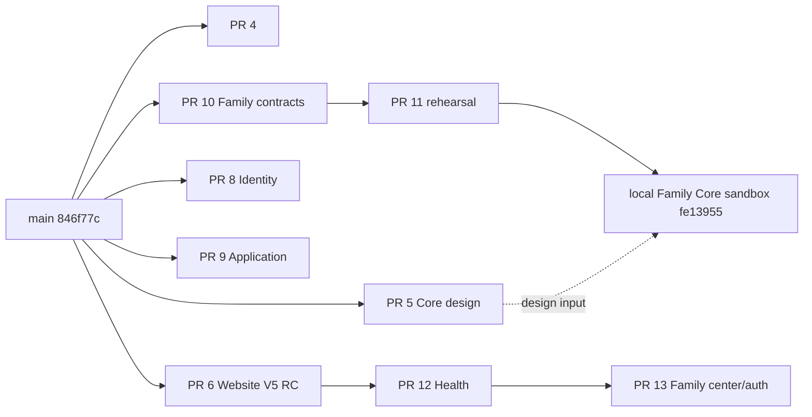

# Phoenix PR Dependency Map

Status: `AUDITED 2026-09-09 / NO MERGE PERFORMED`

Repository main at audit: `846f77c120cd00a49d89635dd4297b020af7d03a`.

| PR | Head SHA | Base / direct dependency | GitHub state | Scope / disposition |
| --- | --- | --- | --- | --- |
| #4 | `b97dcd4dca26f08e72d172ccf9e92918512ff068` | `main` | Draft | Family OS Sprint 2 integration/preview; overlaps later contracts |
| #5 | `38199a3ba38a12db82241e0ac8e4e02a57efc18f` | `main` | Draft | Founder-approved Core identity Gate 0/1 design; documentation authority |
| #6 | `02859e6427de31a4feedac158d23a36cf56625bc` | `main` | Open, ready for review | Website V5/Digital East release candidate |
| #8 | `622f425e1f201e7ac62a2aea920aff240cb1ca73` | `main` | Draft | Identity Compass Gate 2; local/browser persistence, integration hold |
| #9 | `ebeaa1538eaf8c1476b1c63b6d7e77f6b42c4c44` | `main` | Draft | Application/Masters intake P0; controlled test gate still external |
| #10 | `39452d9cb1c15f96baabb5b887c86ab0afbb97ed` | `main` | Draft | Family OS cross-domain contract preparation |
| #11 | `921f398670b7ba764f2649f5d28462ed4234b849` | PR #10 branch/head | Draft | 76-test synthetic in-memory contract rehearsal; no DB |
| #12 | `21b859fa88f16ec0c6f6dd0d0046eaef049af0c6` | PR #6 | Draft | Health Compass integration candidate; current work plan says defer Health |
| #13 | `91608c1a69a029df903066e409b08d894101cea2` | PR #12 | Draft | V5 family center/account candidate; inherits PR #12 Health work |

## DAG

## Overlap and conflict audit

- PR #10 and #11 are a strict stack. PR #11 must not be merged as if based directly on `main` without preserving/rebasing its contract parent.
- The local Family Core sandbox extends PR #11 and additionally imports PR #5 design. It needs review against both histories before choosing a merge base.
- PR #12 and #13 form a strict Website stack. PR #13 includes Health work that the current Founder task explicitly defers, so PR #13 is not the Website V5 release baseline.
- PR #13 D1 authentication must preserve Core UUID/linkage rules and must not become an alternative User/Family master.
- PR #9 heavily overlaps the actively modified Education Compass tree. Do not cherry-pick or switch the dirty `D:\phoenix` worktree; use a clean ref/worktree and a deliberate integration review.
- PR #4, PR #10/#11, and the current Family Core work cover related Family OS context/contract territory. Compare behavior and contracts before merging; do not auto-combine by filename.
- PR #5 and PR #8 use similar ID prefixes but different trust levels. Prefix equality is not identity equivalence.

## Safe review order

1. Preserve the active Education repair and collect its committed SHA first.
2. Review PR #6 independently as the Website release candidate.
3. Keep PR #12/#13 on HOLD while Health is deferred; extract no auth code without a dedicated review.
4. Review PR #5 design and PR #10 → #11 contract stack, then review the Family Core sandbox against that base.
5. Review PR #8 and PR #9 as domain adapters only after the Core context contract is accepted.
6. No automatic merge, production migration, or deployment is authorized by this map.
