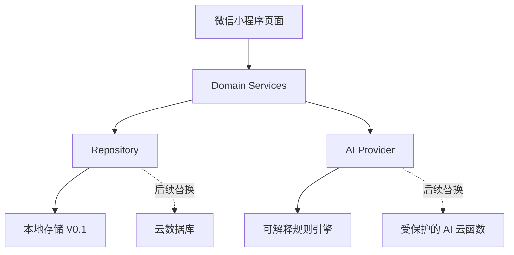
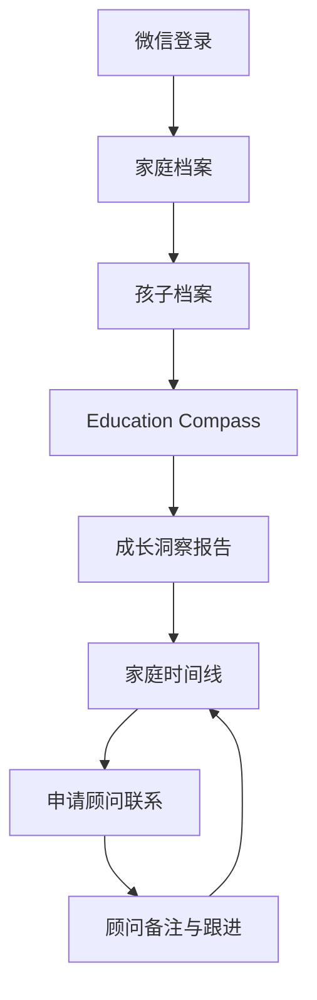

# Phoenix Family OS™ MVP V0.1 Architecture

## 1. 产品边界

当前系统只有两个可操作角色：

- `family_user`：建立家庭关系档案并完成 Education Compass。
- `admin`：Phoenix Advisor 查看档案并记录跟进。

`Partner` 与 `Permission` 仍只存在于数据模型，保持空表。Partner Experience Layer 是家庭端的合作体验配置与申请入口，不创建合作方账号或后台；任何未来合作方都不能绕过家庭授权直接访问家庭数据。

## 2. 运行架构

页面不直接操作存储。未来把 `Repository` 替换为云数据库实现时，家庭端与顾问端页面不需要重写。

Partner Experience Layer 使用 `data/partner-experiences.js` 保存可复用内容配置，页面只负责呈现。首个配置是 `yuanchao`（音乐主题、预览状态），复用 Family Profile、Growth Archive 与 Family Timeline，不创建新的 Compass 或独立用户体系。

## 3. 家庭关系闭环

## 4. 数据归属

所有当前及未来模块必须通过 `family_id` 回到家庭关系层：

- `Student.family_id`
- `Timeline_Event.family_id`
- `Advisor_Note.family_id`
- `Advisor_Request.family_id`
- `Compass_Report → Compass_Assessment → Student → Family`
- `Permission.family_id`（未来授权模型）
- `Partner_Exploration.family_id / student_id`（家庭授权后的音乐探索起点）
- `Partner_Application.family_id / user_id`（联合体验申请，可为空以支持概念演示）

## 5. AI 边界

V0.1 使用 `phoenix_rule_engine_v0.1`，原因是：

- 无需 API Key 即可运行演示；
- 输出稳定、可解释；
- 不把未成年人家庭信息发送给外部服务；
- 可以先验证用户是否愿意完成问卷和阅读报告。

真实 AI 上线时只替换 `services/ai-provider.js`，并必须在云端执行脱敏、鉴权、审计与内容安全校验。

## 6. 视觉策略

视觉使用正式 Phoenix Nova 品牌资产：官方羽翼 Logo、Phoenix Navy、Phoenix Gold、Ivory White、宋体标题和长期陪伴感。品牌组件统一管理深浅背景与小尺寸图标版本；`Phoenix Family OS™` 保持为 Phoenix Nova 旗下独立产品名称。MVP 不直接使用内容海报，也不把个人 IP 作为家庭系统主视觉，避免产品变成内容账号或销售页面。
