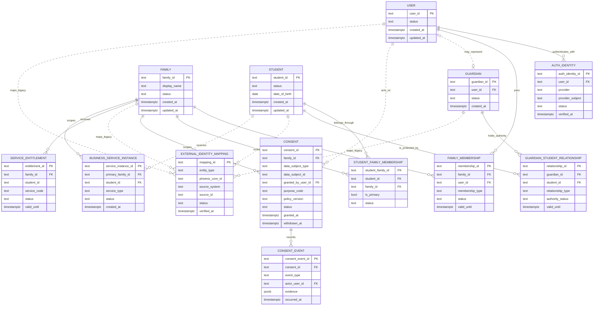
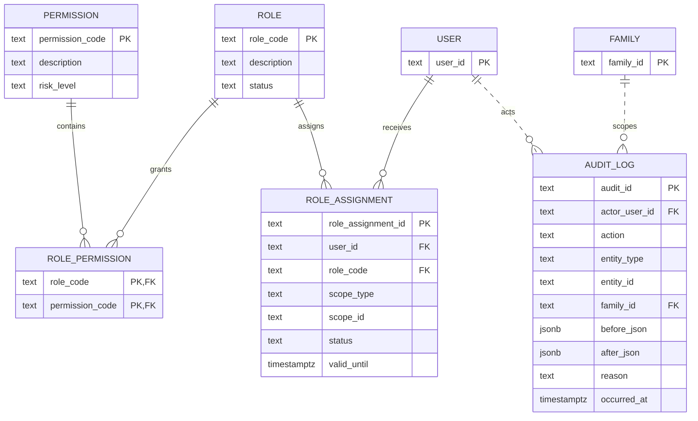

# Phoenix Core PostgreSQL ERD V1 (Proposed)

Status: `FOUNDER-APPROVED — DESIGN ONLY`
Target: RDS PostgreSQL. This document is not executable DDL and performs no deployment.

The ERD is split by bounded context to keep keys and relationships readable. Polymorphic links in mapping, consent, entitlement, and audit require service-level validation or typed association tables in the eventual DDL; they are not silently treated as unrestricted foreign keys.

## Identity, consent, mapping, entitlement

## RBAC and audit

## PostgreSQL enforcement notes

- Use explicit checks for ID prefixes and controlled status values.
- Enforce unique provider identity `(provider, provider_subject)`.
- Enforce unique mapping source `(source_system, entity_type, source_id)`.
- Use partial uniqueness for one active primary Student-Family membership if the business rule is approved.
- Protect family-scoped tables with RLS and application policy checks.
- Require one `primary_family_id` on every business service instance; multi-family membership never implies cross-family access.
- Make audit and consent-event deletion unavailable to application roles.
- Keep `HEALTH` only in the shared Compass registry/enum with `RESERVED` status; no Health table appears in this ERD.
